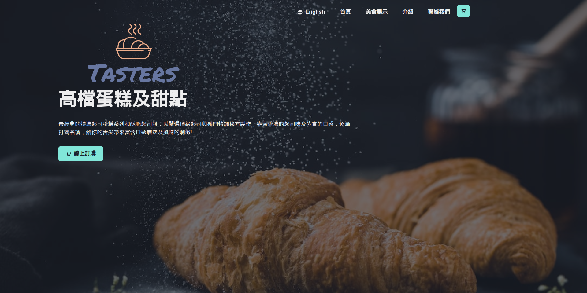

# Taster the bakery

This is the [Shopping Cart](https://www.theodinproject.com/lessons/node-path-javascript-shopping-cart) project from The Odin Project  

[Live Demo](https://ascheabl.github.io/tasters-the-bakery-landing-page/)  

## Only supports 1920 x 1080 resolution currently !

## Built with

- React
- Chakra-UI

## Feature:

- Clean UI/UX
- A shopping cart that that renders products
- Localization for Chinese & English
- Home and Menu page that ultize react-router

## Summary

#### What I learned

When designing webistes, developers should work on "Mobile first" then make the website expand the breakpoints to support larger screens, thus achieving responsive design.  

Github only supports HashRouter for React-Router library  

Chakra-UI and various hooks  

#### Author 

- Github: [aScHEABL](https://github.com/aScHEABL)